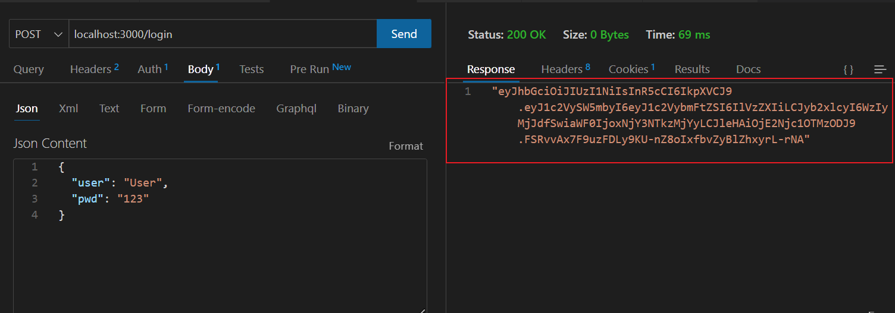
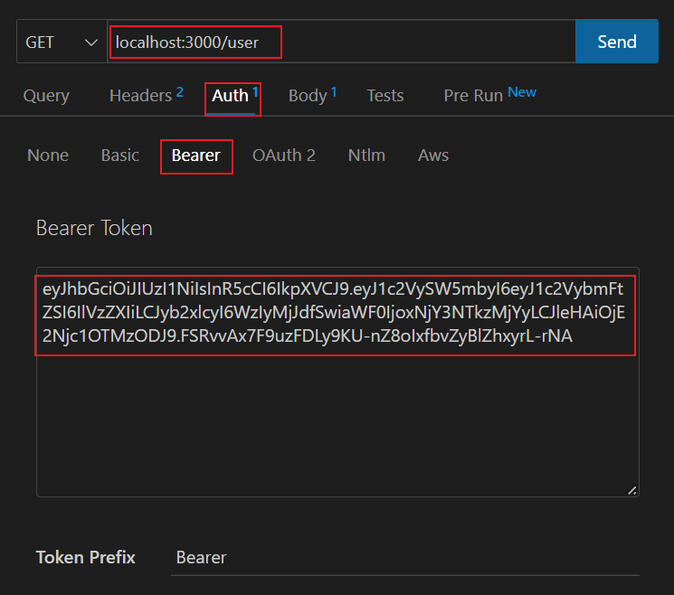

# Table of Contents

  1. [Thunder Client](#thunder-client)


---

## Thunder Client

1) Download Thunder CLient on VS code

---

### Login



1) Copy the Access Token you got on the response (whitout " ")


### Access page with authorization

1) Paste the access token on the auth -> bearer of the requisition



2) If your user has the permission (role), it will authorize you to access the page


<span style="color:red">ATTENTION!</span>

On my code

```javascript
//verifyJWT is that decode the token and pass the role information to the request. I need to call it before verifyRoles!

router.get('/user', verifyJWT, verifyRoles(ROLES_LIST.Admin, ROLES_LIST.User), (req, res) => {
    res.end('You are authorized to access this page!');
});

```
